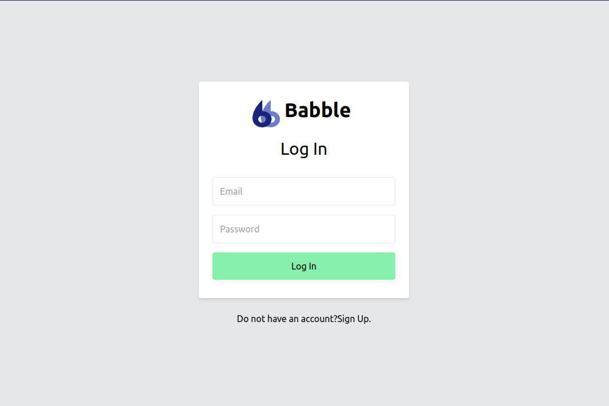
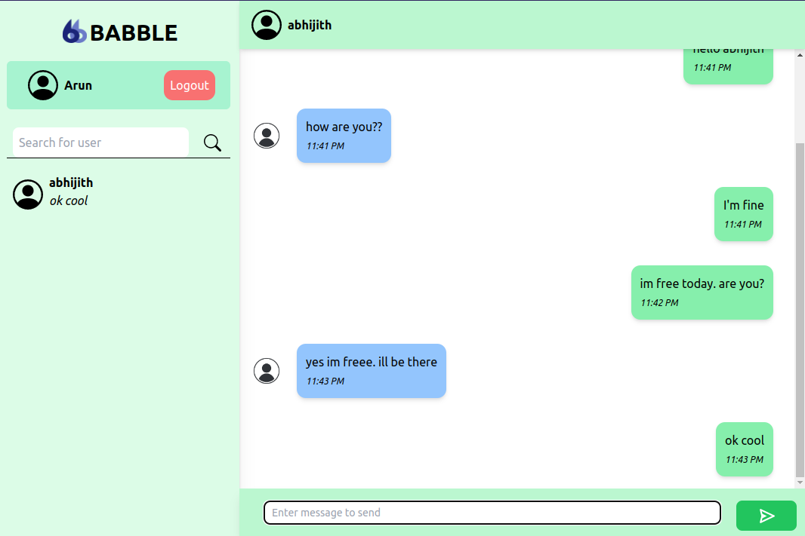
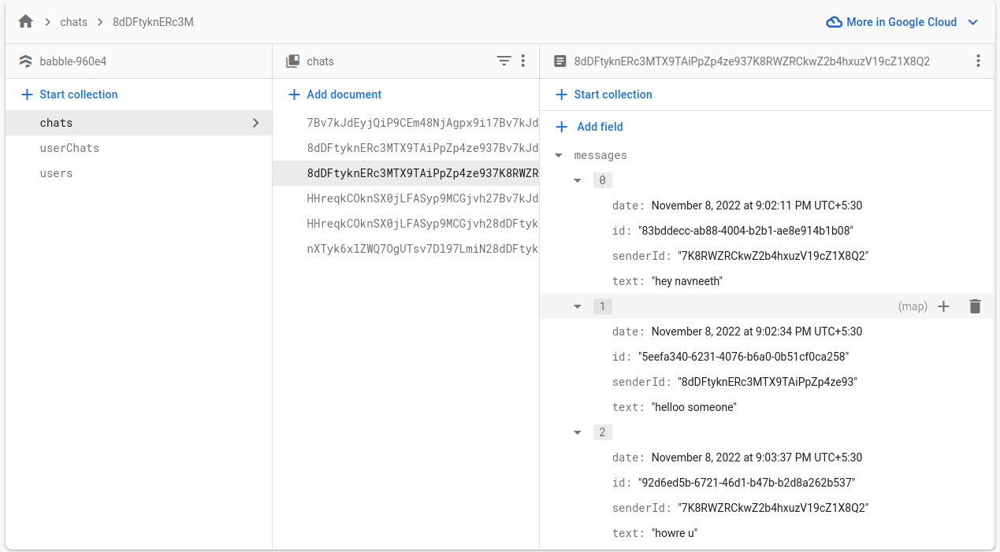

# BABBLE CHAT

This is a chat application created using [Next.js](https://reactjs.org/docs/getting-started.html) and [Firebase](https://firebase.google.com/docs).

## Front-End

The front-end is done using Next.js and [Typescript](https://www.typescriptlang.org/). Various React Hooks like useState, useRef, useContext, useReduce etc. were used for the development of the project. You can refer more more about React Hooks in the [documentation](https://reactjs.org/docs/hooks-intro.html). Styling is done with using [Tailwind](https://tailwindcss.com/).
There are mainly 3 pages included in the web app; the login page, sign up page and the chatscreen page.

### Login Page



### Sign Up Page


### Chats Page



## Back-End

The backend is hosted on firebase and firestore. Authentication is also done using firebase authentication and the storage is done using firestore firebase. The structure of firestore database is:

There are mianly 3 collections created in the firestore database, _chats_, _userChats_, _users_.

- **users** : contains the details of users
- **userChats** : contains the details of users that the logged in user have chatted with. This includes the last message that was sent, the userid.
- **chats** : contains the details of chats between the users. These are accessed by the combined id of both the users.

## Future Improvements

Currently there is no support for sending files or to set a profile picture. In the future, it will be incorporated into the application.

## Deployed on Vercel

Babble is hosted [here](https://babble-chat.ml/).
Create a new account or sign in to your existing account. Have fun Babbling!

## Working Video

The working of the application is given below:

<a href="https://www.loom.com/share/4791de60e99d4630bac7f55d298b8900">
    <p>https://babble-chat.ml/login - 8 November 2022 - Watch Video</p>
    
  </a>

## Getting Started

Clone the repository:

```bash
git clone https://github.com/navneethvarair14/babble.git
```

Then install dependencies:

```bash
npm i
```

Run the development server:

```bash
npm run dev
# or
yarn dev
```

Open [http://localhost:3000](http://localhost:3000) with your browser to see the result.

You can start editing the page by modifying `pages/index.tsx`. The page auto-updates as you edit the file.

[API routes](https://nextjs.org/docs/api-routes/introduction) can be accessed on [http://localhost:3000/api/hello](http://localhost:3000/api/hello). This endpoint can be edited in `pages/api/hello.ts`.

The `pages/api` directory is mapped to `/api/*`. Files in this directory are treated as [API routes](https://nextjs.org/docs/api-routes/introduction) instead of React pages.
